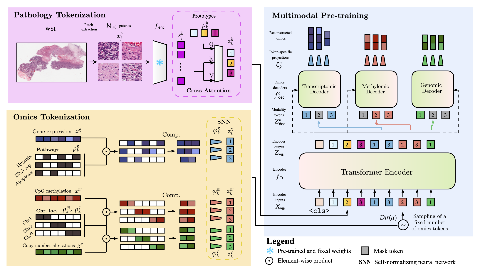

 <h1> Masked Omics Modeling for Multimodal Representation Learning across Histopathology and Molecular Profiles </h1>

We introduce the first multimodal pretraining strategy tailored for cancer biology, using a transformer with a masked modeling objective to reconstruct masked omics modalities (RNA, DNAm, CNV), supported by histopathology.

Supporting code for the corresponding [paper](https://www.arxiv.org/pdf/2508.00969)

# 🌰 In a nutshell
**MORPHEUS** is a multimodal pre-training method based on masked omics modeling. 
It uses the code from masked modeling in NLP or computer vision, but on omics portions.
In concrete terms, once pre-trained, the encoder can be used on different tasks and with different combinations of input modalities.
It can also reconstruct any omic profile from histopathology.
Unfortunately, due to the UNIv2 licensing restrictions, we are unable to provide pre-trained weights for **MORPHEUS**. 
However, we provide step-by-step instructions to reproduce the results exactly.


<div align="center">
  
</div>

<br>

# 📂 The Data
For data and preprocessing, you will need to follow the instructions given in the notebook `data/preprocessing.ipynb`.
More specifically, for WSI, you'll need to download the embeddings of the patches already extracted from UNIv2 from the official [HuggingFace Dataset](https://huggingface.co/datasets/MahmoodLab/UNI2-h-features).
For omics data: <br>
**Gene expression (RNA)**: Downloaded from the USCS Xena Database (explained in `data/preprocessing.ipynb`)
**DNA Methylation (DNAm) and Copy Number Variations (CNV)**: You will need to download data from GDC Data Portal (you can follow the instructions of [MultiSurv](https://github.com/luisvalesilva/multisurv/tree/master/data) or [DRIM](https://github.com/Lucas-rbnt/DRIM/tree/main/data))


# 🧠 Reconstructing omics modalities
**MORPHEUS** allows simple reconstruction of any combination of omics modalities.
Concrete examples are given in the file: `reconstructions.ipynb`.
<br>
<br>

# 🔄 Pretraining MORPHEUS
Once all the data is properly prepared following the `data` instructions.
Run the following
```
$ python pretrain_bmmae.py --project_id pancan --data_dir /PATH/TO/WSI
```

# 🎯 Fine-tuning
Fine-tuning **MORPHEUS** for few-shot subtyping or survival analysis is straightforward. 
For instance on WSI only
```
$ python wsi_surv.py --project_id gbmlgg --data_dir /PATH/TO/WSI
```
or combined with RNA
```
$ python wsi_rna_surv.py --project_id gbmlgg --data_dir /PATH/TO/WSI
```

For 5-shot subtyping, use the following CLI: 
<br>
```
$ python wsi_few_shot.py --task breast --k 5 --data_dir /PATH/TO/WSI
```

# ⭐ Contribute & Support

💡 We are aware that biological data can be challenging to download, preprocess, and interpret. We have tried to make the process as straightforward as possible by following clear instructions. However, if any part is unclear or lacks sufficient detail, feel free to open an issue or submit a pull request.
<br>
<br>
